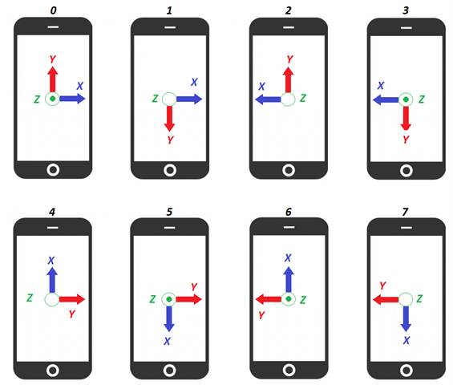

# edmp_apex

This application demonstrates how to configure and use APEX features.

It allows enabling individually pedometer, SMD, tilt, raise-to-wake, tap and freefall (including lowGee and highGee) eDMP features. Any APEX feature update is notified through INT1. Power save mode can be selected and works in addition with Wake On Motion (WOM) to wake up eDMP only when motion is detected.

It automatically enables accelerometer at appropriate frequency and in optimal power mode depending on requested feature combination.

At startup, all features are enabled by default so accel is enabled in Low-Noise at 800Hz.

## Command interface

This application allows the following command to be sent through UART:
* `p`: to enable/disable pedometer feature (defaults to enable).
* `s`: to enable/disable SMD feature (defaults to enable).
* `t`: to enable/disable Tilt feature (defaults to enable).
* `r`: to enable/disable Raise-To-Wake feature (defaults to enable).
* `a`: to enable/disable Tap feature (defaults to enable).
* `f`: to enable/disable Freefall feature (defaults to enable).
* `l`: to enable/disable LowGee feature (defaults to enable).
* `i`: to enable/disable HighGee feature (defaults to enable).
* `o`: to enable/disable Power save mode (defaults to disable).
* `c`: to print current configuration.
* `h`: to print help screen.

Accel is enabled at 50Hz or 100Hz in Low-Power mode or at 800Hz in Low-Noise mode depending on features requested to achieve optimal power consumption.


## Terminal output

### Data format

Data are printed on the terminal as follow:

For all cases, `<timestamp>` is the time in microsecond read from MCU clock.

#### Pedometer event
```
<timestamp> us   STEP_DET count: <step_count> steps cadence: <cadence> steps/s activity: <activity_class>
```

With:
* `<step_count>`: Number of steps as reported by eDMP
* `<cadence>`: Number of steps per second
* `<activity_class>`: Type of activity detected (Run, Walk, Unknown)

**Note:** Step count and cadence are valid only once the step count starts incrementing. `<activity_class>` will remain _Unknown_ meanwhile.

#### SMD event
```
<timestamp> us   SMD
```

Once the example is running, the user shall simulate a displacement to generate a SMD. A displacement is typically simulated by doing "steps" (moving the board up and down for ~8 sec).

#### Tilt event
```
<timestamp> us   TILT
```

Once the example is running, tilting the board with an angle of 30 degrees or more will generate a tilt. By default, a tilt event is generated when the position is held for 4 seconds.

#### Raise-To-Wake event
```
<timestamp> us   R2W_WAKE
<timestamp> us   R2W_SLEEP
```

Considering a device with screen, a `R2W_WAKE` event is fired when the user looks at the screen. A `R2W_SLEEP` event is fired when the device is put back on the table, or after a time out.

A mounting matrix can be configured with `apex_parameters.r2w_mounting_matrix` (default to 0). Please refer to the following picture to identify how to set the mounting matrix, depending on the IMU reference frame, so the 'WAKE' interrupt is fired when user looks at the screen.



**Note:** The default value for the `r2w_sleep_time_out` parameter is 64 which corresponds to a delay of 0.64 s. As implemented in this example, it is advised to change it to 6400 which corresponds to a delay of 6.4 s.


#### Tap event
```
<timestamp> us   TAP Single Direction: <axis> <sign>
<timestamp> us   TAP Double Direction: <axis> <sign> duration: <duration> us
```

With:
* `<axis>`: X or Y or Z
* `<sign>`: + or -
* `<duration>`: Double tap duration in us

In case of double tap on different axis, the axis reported is the first axis impacted.

#### Freefall event
```
<timestamp> us   FREEFALL duration: <sample_count> samples (<duration> ms)
```

With:
* `<sample_count>`: Number of samples during which freefall occurred
* `<duration>`: Freefall duration in ms

The freefall feature uses a low-g and a high-g detector to detect freefall beginning and end. When a freefall is detected, an interrupt is triggered and the duration of the fall is printed. The duration is given in number of samples and can be converted to a distance with the following formula:

𝐹𝐹𝑑𝑖𝑠𝑡𝑎𝑛𝑐𝑒=9.81×(𝐹𝐹𝑑𝑢𝑟𝑎𝑡𝑖𝑜𝑛×e𝐷𝑀𝑃_𝑂𝐷𝑅𝑠𝑒𝑐)²/2

#### LowG event
```
<timestamp> us   LOW_G
```

#### HighG event
```
<timestamp> us   HIGH_G
```

### Example of output

```
[I] ###
[I] ### Example EDMP APEX
[I] ###
[I] #
[I] # Current configuration
[I] #
[I] # Pedometer: Enabled
[I] # SMD: Enabled
[I] # Tilt: Enabled
[I] # R2W: Enabled
[I] # Tap: Enabled
[I] # Freefall: Enabled
[I] # LowG: Enabled
[I] # HighG: Enabled
[I] #
[I] # ODR: 800 Hz
[I] #
[I]       4620412 us   STEP_DET     count:     0 steps   cadence: 2.0 steps/s   activity: Unknown
[I]       4979164 us   STEP_DET     count:     0 steps   cadence: 2.0 steps/s   activity: Unknown
[I]       5357850 us   STEP_DET     count:     6 steps   cadence: 2.0 steps/s   activity: Unknown
[I]       5696635 us   STEP_DET     count:     7 steps   cadence: 2.1 steps/s   activity: Walk
[I]       6095235 us   STEP_DET     count:     8 steps   cadence: 2.2 steps/s   activity: Walk
[I]       6414138 us   SMD
[I]       6509453 us   TAP     Single   Direction: Y+
[I]       6553624 us   STEP_DET     count:     9 steps   cadence: 2.2 steps/s   activity: Walk
[I]      21164854 us   R2W_WAKE
[I]      21364171 us   R2W_SLEEP
[I]      23676232 us   TAP     Single   Direction: Z-
[I]      32908480 us   TAP     Single   Direction: Y+
[I]      33567373 us   TAP     Single   Direction: Y-
[I]      34375739 us   TAP     Double   Direction: Y+   duration: 28750 us
[I]      35257572 us   TAP     Single   Direction: Y+
[I]      36534350 us   TAP     Single   Direction: X-
[I]      37622990 us   TAP     Single   Direction: X-
[I]      41207823 us   TAP     Single   Direction: Z+
[I]      56022468 us   TILT
```


